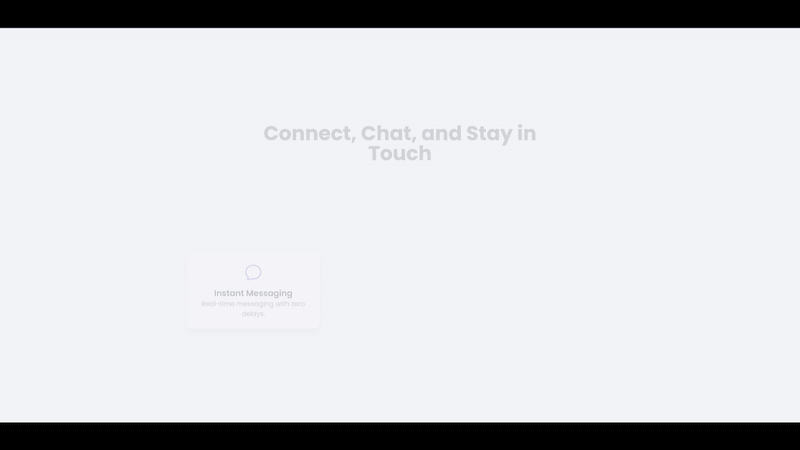
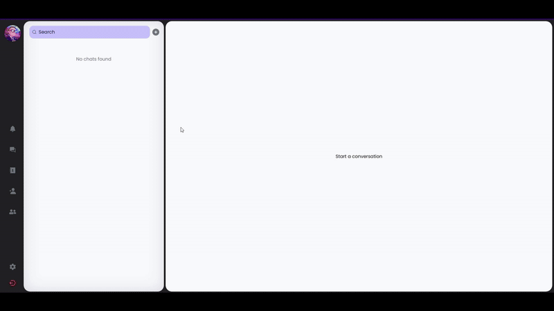
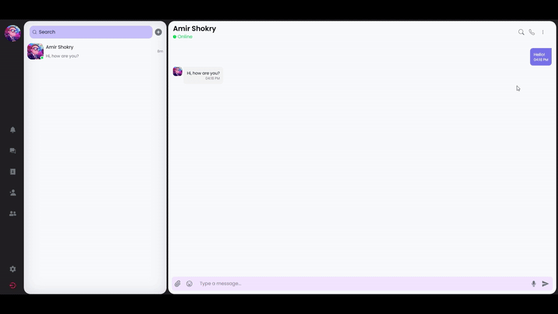
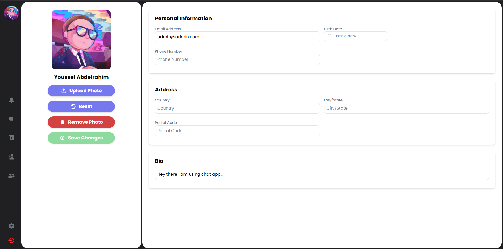

# [Plausch](https://github.com/youssefezzat304/Dialog.io-realtime-chat)

A real-time chat application built with Next.js, Node.js, Express, Socket.IO, MongoDB, and TypeScript . This project is primarily developed for **educational purposes**, serving as a hands-on learning experience in building real-time web applications with modern web technologies.

## Installation & Setup

Clone the Repository

```bash
git clone https://github.com/youssefezzat304/Plausch.git
cd Plausch
```

Install Dependencies

```bash
cd packges/server
npm install
```

```bash
cd packages/client
npm install
```

##### Setup environment variables

Server

```
// .env

NODE_ENV=development

PORT=<your-port>

DATABASE_CONNECTION="mongodb+srv://<email>:<password>@******"

NEXTAUTH_SECRET="<your-secret-key>"
```

Client

```
// .env

NEXTAUTH_SECRET="<your-secret-key>" (the same key as in the server environment variables)

NEXTAUTH_URL="<your-auth-url>"

NEXT_PUBLIC_SOCKET_URL="<your-socket-url>"
```

#### Run the app

client

```bash
cd packges/client
pnpm run dev
```

server

```bash
cd packges/server
pnpm run dev
```

## Features

### Currently Available

- 🔒 **Authentication & Authorization**
- 📬 **Real-time Messaging**
- 🖼️ **User Profile details**
- 📡 **WebSockets for Instant Updates**
- 🤝 **Add Friends**
- ✅ **Status Check** (Online/Offline)

### Upcoming

- **📂 Sending Media Files** (Images, Videos, Documents)
- 🔍 **Search** (Users, Messages, and Chats)
- 👥 **Group Chat** (Multiple Participants, Admin Controls)
- 🚫 **Block Users** (Prevent Unwanted Interactions)
- 🎤 **Voice Notes** (Send and Receive Audio Messages)
- 📹 **Video Calls** (One-on-One & Group Video Calls)
- 🧑‍💻 **End-to-End Encryption**
- 🌙 **Dark Mode & Custom Themes**
- 📌 **Pinned Messages & Starred Chats**
- 📨 **Scheduled & Self-Destructing Messages**
- 🔄 **Message Reactions & Edits**
- 🌍 **Multi-Language Support**
- 🤖 **AI Chatbot Integration**

## API Documentation

### User Authentication

| Method | Endpoint             | Description         | Authentication required |
| ------ | -------------------- | ------------------- | ----------------------- |
| `POST` | `/api/auth/register` | Register a new user | ❌ No                   |
| `POST` | `/api/auth/login`    | Login user          | ❌ No                   |
| `POST` | `/api/auth/logout`   | Logout user         | ✅ Yes                  |
| `GET`  | `/api/auth/me`       | Get current user    | ✅ Yes                  |

### Users

| Method  | Endpoint         | Description          | Authentication required |
| ------- | ---------------- | -------------------- | ----------------------- |
| `GET`   | `/users/:userId` | Get specific user    | ✅ Yes                  |
| `PATCH` | `/users/:userId` | Update specific user | ✅ Yes                  |

### Friends

| Method | Endpoint                  | Description              | Authentication required |
| ------ | ------------------------- | ------------------------ | ----------------------- |
| `GET`  | `/:userId/privateChats`   | Get private chats list   | ✅ Yes                  |
| `GET`  | `/:userId/contacts`       | Get contacts list        | ✅ Yes                  |
| `GET`  | `/:userId/friendRequests` | Get friend requests list | ✅ Yes                  |

### Messages

| Method | Endpoint                   | Description                            | Authentication required |
| ------ | -------------------------- | -------------------------------------- | ----------------------- |
| `GET`  | `/message/:conversationId` | Get messages for specific conversation | ✅ Yes                  |

### Private chat

| Method | Endpoint               | Description               | Authentication required |
| ------ | ---------------------- | ------------------------- | ----------------------- |
| `GET`  | `/privateChat/:chatId` | Get specific chat details | ✅ Yes                  |

### Real-time events

| Event name              | Triggered when                      |
| ----------------------- | ----------------------------------- |
| `"addFriend"`           | user adds a friend                  |
| `"friendRequest"`       | user sends a friend request         |
| `"acceptFriendRequest"` | user accepts a friend request       |
| `"rejectFriendRequest"` | user rejects a friend request       |
| `"joinConversation"`    | user joins a conversation           |
| `"leaveConversation"`   | user leaves a conversation          |
| `"sendMessage"`         | user sends a message                |
| `"newMessage"`          | new message is received             |
| `"typing"`              | user is typing a message            |
| `"onlineFriends"`       | user's friends online status change |

## 🖼️ Screenshots

This interface incorporates design elements inspired by [Ronas IT | UI/UX Team](https://dribbble.com/shots/23280048-Web-Chat-UI).

### Landing page (Temporary)



### Login page


### Add Friend



### Copy message and Chat info



### User Profile



more screenshots coming soon...

## License

This project is licensed under the **MIT License** .
